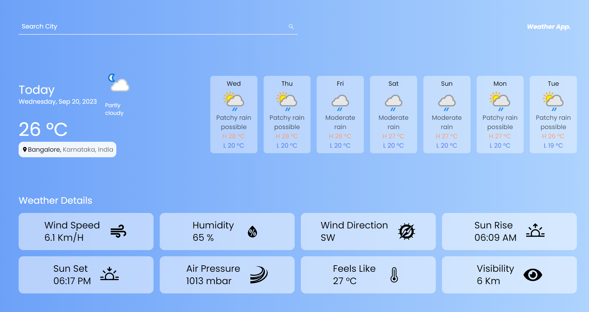

# WeatherWiz - Your Ultimate Weather App 🌦️



- Site Live [Link](https://weather-app-xi-cyan.vercel.app/)

Welcome to WeatherWiz, your one-stop destination for all your weather forecasting needs! With WeatherWiz, you can effortlessly stay up-to-date with the latest weather conditions and forecasts for any location in the world. Our app is built using cutting-edge web technologies, including Next.js 13, Tailwind CSS, TypeScript, and more.

## Features

- **Real-time Weather Information**: Get real-time weather data for any location worldwide.
- **7-Day Forecast**: Plan your week ahead with a detailed 7-day weather forecast.
- **Responsive Design**: Enjoy a seamless experience on desktop, tablet, and mobile devices.

## Technologies Used

- **Next.js 13**: A powerful React framework for building server-rendered web applications.
- **Tailwind CSS**: A utility-first CSS framework for creating stylish and responsive web interfaces.
- **TypeScript**: A statically-typed superset of JavaScript that enhances code quality and developer productivity.
- **APIs**: We use weather APIs to fetch accurate and up-to-date weather data.

## Getting Started

To run WeatherWiz locally, follow these steps:

1. Clone this repository to your local machine:

   ```bash
   git clone https://github.com/CRAZy-Monk3Y/Weather-App
   ```

2. Install the project dependencies:

   ```bash
   cd weather-app
   npm install
   ```

3. Start the development server:

   ```bash
   npm run dev
   ```

4. Open your browser and visit [http://localhost:3000](http://localhost:3000) to use WeatherWiz locally.

## Deployment

You can deploy WeatherWiz to your preferred hosting platform. Here are some common deployment options:

- **Vercel**: Deploy seamlessly with Vercel by linking your GitHub repository.
- **Netlify**: Easily deploy using Netlify with automatic CI/CD.
- **Docker**: Containerize the app and deploy it using Docker.

Choose the deployment option that suits your needs best and follow their respective documentation for deployment instructions.

## Contributing

We welcome contributions from the community. If you'd like to contribute to WeatherWiz, please follow these steps:

1. Fork the repository and create a new branch.

2. Make your changes and ensure they follow our coding guidelines.

3. Test your changes thoroughly.

4. Submit a pull request with a clear description of your changes.

5. Our team will review your pull request and provide feedback.

## Contact

Thank you for choosing WeatherWiz for all your weather-related needs! Enjoy exploring the weather like never before. 🌤️

## Author

This app is made by [Tathagata Chakraborty](https://github.com/CRAZy-Monk3Y). Feel free to star this repo.
